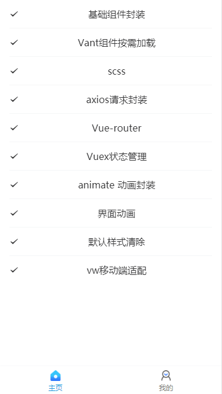
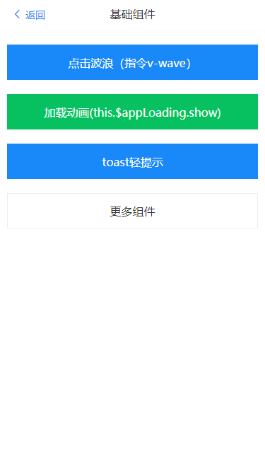
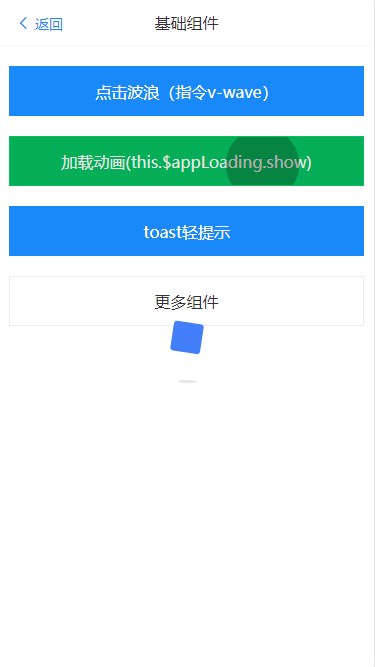

# vue-mobile-template

基于 vue-cli4.0 + vant ui + sass+ vw 适配方案+axios 封装等，构建的手机端脚手架

<p>
  
  
  
</p>
 
# 线上地址

<p >
  <a href="http://121.196.24.206/">
    vue-mobile-template
  </a>
</p>

# 启动项目

npm install

npm run serve

### <span id="rem">✅ vw 适配方案 </span>

之前做移动端适配时，基本上是采用rem方案，但现在viewport单位越来越受到众多浏览器的支持

Vant 中的样式默认使用px作为单位，在这里我们使用vw进行适配，使用的是下面的一个工具：

- 【postcss-px-to-viewport】，将px单位自动转换成viewport单位

```javascript
module.exports = {
    plugins: {
      autoprefixer: {
        overrideBrowserslist: ['Android 4.1', 'iOS 7.1', 'Chrome > 31', 'ff > 31', 'ie >= 8']
      }, // 用来给不同的浏览器自动添加相应前缀，如-webkit-，-moz-等等
      "postcss-px-to-viewport": {
        unitToConvert: "px", // 要转化的单位  rootValue: 37.5,
        viewportWidth: 375, // UI设计稿的宽度
        unitPrecision: 3, // 转换后的精度，即小数点位数
        propList: ["*"], // 指定转换的css属性的单位，*代表全部css属性的单位都进行转换
        viewportUnit: "vw", // 指定需要转换成的视窗单位，默认vw
        fontViewportUnit: "vw", // 指定字体需要转换成的视窗单位，默认vw
        selectorBlackList: ['.ignore'], // 指定不转换为视窗单位的类名，
        minPixelValue: 1, // 默认值1，小于或等于1px则不进行转换
        mediaQuery: true, // 是否在媒体查询的css代码中也进行转换，默认false
        replace: true, // 是否转换后直接更换属性值
        exclude: [/node_modules/], // 设置忽略文件，用正则做目录名匹配
        landscape: false // 是否处理横屏情况
      }
    }
  };
